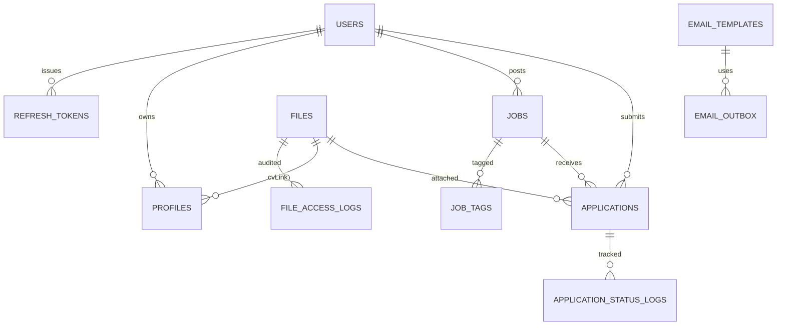
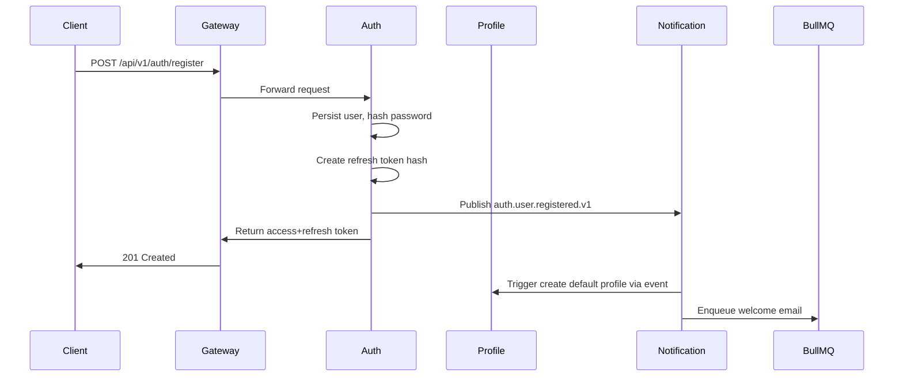
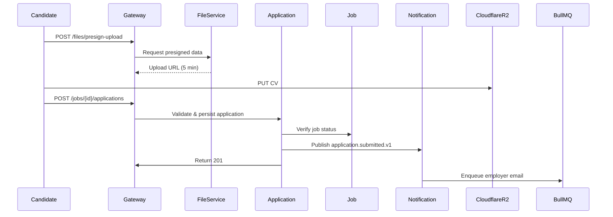
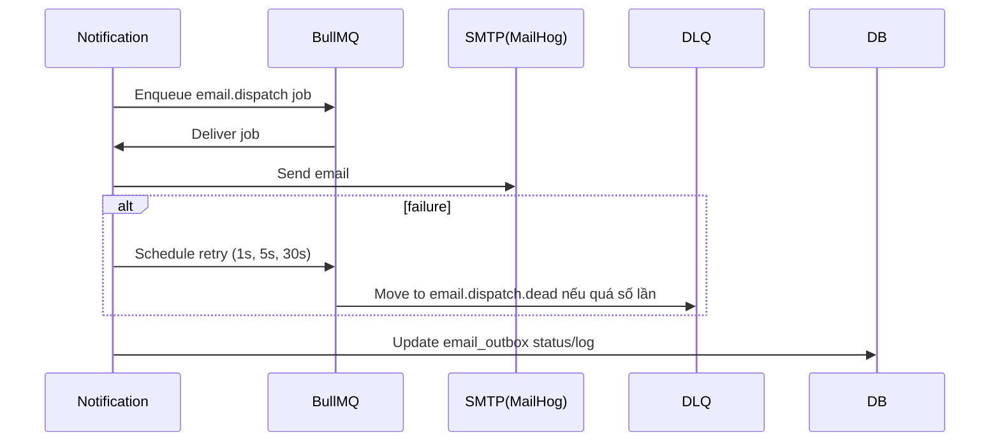

# Technical Design Document: Job Finder Backend Platform

## 1. Overview
Hệ thống “Job Finder” cung cấp nền tảng kết nối ứng viên và nhà tuyển dụng theo kiến trúc microservice Node.js/Express. Mục tiêu đồ án là xây dựng backend phục vụ đăng ký người dùng, quản lý hồ sơ, đăng tin tuyển dụng, nộp hồ sơ, lưu trữ CV, gửi email thông báo và quan sát hệ thống. Tài liệu này gom các quyết định kiến trúc hiện tại và định hướng triển khai cho toàn bộ dịch vụ.

## 2. Requirements

### 2.1 Functional Requirements
- Xác thực & quản lý người dùng với phân quyền candidate, employer, admin; phát hành access/refresh token RS256.
- Ứng viên cập nhật hồ sơ cá nhân, upload CV; nhà tuyển dụng cập nhật thông tin công ty; admin xem hồ sơ.
- Nhà tuyển dụng tạo tin tuyển dụng (tiêu đề, mô tả, kỹ năng, mức lương, địa điểm, loại hình); admin duyệt/reject.
- Ứng viên tìm kiếm, lọc job (từ khóa, kỹ năng, địa điểm, mức lương) với phân trang.
- Ứng viên nộp đơn (gắn CV); employer xem danh sách ứng viên và thay đổi trạng thái (submitted → reviewed → interview → offer → rejected).
- File service quản lý upload CV lên Cloudflare R2, lưu metadata, cung cấp link tải có kiểm soát.
- Notification service gửi email khi ứng viên nộp đơn, khi trạng thái thay đổi, và các email nghiệp vụ khác.
- API Gateway/BFF làm điểm truy cập duy nhất cho mobile/web.
- Admin CLI nội bộ hỗ trợ duyệt job, khóa employer, thao tác dữ liệu nghiệp vụ.

### 2.2 Non-Functional Requirements
- Microservice độc lập DB/schema; giao tiếp qua NATS (event-driven).
- Bảo mật: JWT RS256, mật khẩu hash bcrypt, presigned URLs ngắn hạn, rate limiting tại Gateway.
- Hiệu năng: p95 < 300 ms (theo overview), rate limit đăng job/ứng tuyển để tránh spam.
- Độ tin cậy: retry gửi email với backoff 1s/5s/30s; queue dead-letter cho lỗi cố định.
- Retention: giữ dữ liệu ứng tuyển trong MySQL 24 tháng, sau đó archive sang storage lạnh (tài liệu mô tả quy trình nhưng chưa tự động hóa).
- Observability: mỗi service có /health, log Pino JSON, metrics Prometheus.
- Tài liệu OpenAPI cho Auth, Job, Application; Gateway tổng hợp.
- Deploy giai đoạn đồ án trên môi trường local (Docker Compose) nhưng kiến trúc chuẩn bị sẵn cho mở rộng.

## 3. Technical Design

### 3.1 Data Model Changes
Mỗi service sở hữu schema riêng. Các bảng chính:

- Auth service:
  - `users`: id (UUID), email (unique), password_hash, role (enum), status, created_at, updated_at.
  - `refresh_tokens`: id, user_id, device_id, token_hash, issued_at, expires_at, revoked_at, user_agent, ip_address; index `(user_id, device_id)`.

- Profile service:
  - `profiles`: id, user_id, full_name, phone, years_experience, skills (JSON), cv_file_id, linkedin_url, company_name, location, created_at, updated_at.

- Job service:
  - `jobs`: id, employer_id, title, description, salary_min, salary_max, currency, location, job_type (enum), status (pending/approved/rejected), published_at, expires_at, created_at, updated_at.
  - `job_tags`: job_id, tag (PK composite).
  - `job_audit_logs`: id, job_id, action, actor_id, note, created_at.

- Application service:
  - `applications`: id, job_id, candidate_id, status, cv_file_id, cover_letter, created_at, updated_at.
  - `application_status_logs`: id, application_id, status_from, status_to, actor_id, note, created_at.

- File service:
  - `files`: id, owner_user_id, original_name, mime_type, size_bytes, storage_key, checksum, visibility, created_at, expires_at (nullable).
  - `file_access_logs`: id, file_id, actor_id, action, ip_address, user_agent, created_at.

- Notification service:
  - `email_templates`: id, template_key, subject, body_html, body_text, locale, brand_config, updated_at.
  - `email_outbox`: id, recipient_email, template_key, payload JSON, status, last_error, attempt_count, last_attempt_at, created_at, updated_at.

Mermaid ERD (rút gọn quan hệ chính):

### 3.2 API Changes
API Gateway exposes REST endpoints, forwarding to services via internal URLs:

| Domain | Endpoint | Method | Auth | Description |
|---|---|---|---|---|
| Auth | `/api/v1/auth/register` | POST | No | Đăng ký, trả access/refresh token |
| Auth | `/api/v1/auth/login` | POST | No | Đăng nhập, trả access/refresh token |
| Auth | `/api/v1/auth/refresh` | POST | Refresh token | Phát token mới, ghi nhận rotation |
| Auth | `/api/v1/auth/logout` | POST | Access token | Revoke refresh token theo device |
| Profile | `/api/v1/profiles/me` | GET/PUT | Access | Xem/cập nhật hồ sơ cá nhân |
| Profile | `/api/v1/profiles/company` | PUT | Employer | Cập nhật thông tin công ty |
| Job | `/api/v1/jobs` | POST | Employer | Tạo job ở trạng thái pending |
| Job | `/api/v1/jobs` | GET | Optional | Phân trang (`page`, `pageSize` 10–50, mặc định 20), filter `tag`, `location`, `salaryMin`, `salaryMax`, `keyword` |
| Job | `/api/v1/jobs/{id}` | GET | Optional | Chi tiết job |
| Job | `/api/v1/jobs/{id}/status` | PATCH | Admin (CLI) | Duyệt hoặc từ chối job |
| Application | `/api/v1/jobs/{id}/applications` | POST | Candidate | Nộp đơn, đính kèm `cvFileId`, `coverLetter` |
| Application | `/api/v1/applications/mine` | GET | Candidate | Danh sách đơn đã nộp |
| Application | `/api/v1/jobs/{id}/applications` | GET | Employer | Danh sách ứng viên cho job |
| Application | `/api/v1/applications/{id}/status` | PATCH | Employer/Admin | Cập nhật trạng thái hồ sơ |
| File | `/api/v1/files/presign-upload` | POST | Authenticated | Lấy URL upload R2; body chứa `mimeType`, `size` |
| File | `/api/v1/files/{id}/download` | GET | Authenticated | Gateway xác thực với Application service trước khi trả presigned URL (TTL 5 phút) |
| File | `/api/v1/files/{id}` | DELETE | Admin/Application | Xóa file, chỉ gọi bởi Application service hoặc admin CLI |
| Notification | `/internal/notifications/email` | POST | Service token | Endpoint nội bộ (dự phòng); default dùng event |

Mã lỗi chuẩn: `ERR_VALIDATION`, `ERR_AUTH_*`, `ERR_RATE_LIMIT`, `ERR_NOT_FOUND`, `ERR_FORBIDDEN`, `ERR_INTERNAL`.

### 3.3 UI Changes
Chưa có portal; giai đoạn này dùng Admin CLI:
- Lệnh: `approve-job`, `reject-job`, `ban-employer`, `list-applications`, `resend-email`, `purge-file`.
- Yêu cầu admin JWT hoặc token trong `.env`.
- Mỗi lệnh ghi log vào bảng `admin_actions` (id, actor_id, command, payload, created_at) để audit.

### 3.4 Logic Flow
Đăng ký người dùng:

Nộp đơn ứng tuyển:

Xử lý email:

### 3.5 Dependencies
- Runtime: Node.js 20.x, npm workspaces.
- Framework: Express, Zod, Prisma, Pino, prom-client.
- Messaging: NATS (`@nats.io/nats`).
- Queue: BullMQ (Redis).
- Auth: `jsonwebtoken`, `jose`, `bcrypt`.
- Storage: Cloudflare R2 qua `@aws-sdk/client-s3`.
- Email: Nodemailer (MailHog trong dev).
- Infrastructure: MySQL (mỗi service), Redis (queue & rate limit), NATS server.

### 3.6 Security Considerations
- JWT access token 15 phút; refresh token TTL 30 ngày, lưu hash trong `refresh_tokens`, revoke bằng cách set `revoked_at`.
- RS256 keys quản lý qua `.env` từng service; chia sẻ public key qua shared-config.
- Bắt buộc HTTPS ở gateway, service nội bộ chạy sau reverse proxy.
- Rate limit Redis token bucket: login/register 10/min/IP, job post 30/ngày/employer, application 100/ngày/candidate, file download 60/giờ/user.
- File download chỉ cấp cho candidate sở hữu hoặc employer liên quan; presigned URL TTL 5 phút, log mỗi lượt truy cập.
- Bcrypt hash cost 12; validation input bằng Zod; sanitize file metadata.
- Admin CLI yêu cầu token, ghi log audit; các lệnh nhạy cảm (ban-employer, purge-file) chỉ admin.

### 3.7 Performance and Reliability Considerations
- Phân trang 20 mục (10–50) để tránh query lớn; chỉ mục trên cột filter (tag, location, salary).
- Queue email retry với backoff 1s→5s→30s; dead-letter queue để manual review.
- Giới hạn file upload 10MB; sử dụng R2 presigned để giảm load server.
- Event NATS dùng tên chuẩn `service.domain.event.v1` kèm `eventVersion`.
- Dữ liệu ứng tuyển giữ 24 tháng; job `archive` job hàng ngày sang storage lạnh (có thể bằng cron).

### 3.8 Observability and Operations
- Log Pino JSON gồm `timestamp`, `service`, `level`, `requestId`, `userId`, `route`, `statusCode`.
- Prometheus metrics: `http_request_duration_seconds`, `http_requests_total`, `queue_job_failures_total`, `emails_sent_total`, `file_downloads_total`.
- `/health` mỗi service kiểm tra kết nối DB, Redis, NATS; trả JSON status.
- Config qua `.env`; secrets không commit. Khi mở rộng production, chuyển sang secret manager/Vault.
- Khuyến nghị gom log/metrics về ELK/Grafana trong giai đoạn sau (hiện chưa triển khai).

## 4. Testing Plan
- Dùng script seed Prisma tạo dữ liệu mẫu: admin, employer, candidate, job, job_tags, applications, email template.
- Test thủ công qua Postman/Insomnia dựa trên seed; kế hoạch unit/integration chi tiết sẽ bổ sung ở giai đoạn kế tiếp.

## 5. Open Questions
- Hiện chưa ghi nhận thêm câu hỏi; mục này sẽ cập nhật nếu có yêu cầu mới.

## 6. Alternatives Considered
- Retention ứng tuyển: cân nhắc tách bảng archive hoặc chỉ giữ 90 ngày; chọn giữ 24 tháng rồi archive (Option 1).
- Email template: so với lưu DB hoặc dùng dịch vụ ngoài (SendGrid), chọn lưu trong repo notification-service (Option 1).
- Pagination: so với page size tùy ý hoặc cursor/ElasticSearch, chọn page size mặc định 20 + cho phép 10–50 (Option 1).
- Refresh token: đánh giá Redis/stateless JTI; chọn lưu hash MySQL (Option 1).
- Bảo mật file: so với JWT URL tự xác thực hoặc RBAC phức tạp, chọn Application service phát presigned URL (Option 1).
- Rate limiting: cân nhắc edge (Cloudflare) hoặc verify email queue; chọn gateway + Redis token bucket (Option 1).
- Observability: cân nhắc Datadog hoặc log local; chọn pipeline ELK + Prometheus/Grafana (Option 1) khi mở rộng.
- SLA email: so với fallback SMS hoặc outbox cron, chọn retry backoff + queue (Option 1).
- Admin tooling: so với portal hoặc tool bên ngoài, giai đoạn đầu giữ CLI (Option 3).
- OpenAPI: so với publish tự động hoặc hạn chế service, chọn expose `/docs/openapi.json` cho mọi service (Option 1).
- Deployment: so với VPS monolith hoặc PaaS, giữ định hướng local dev + staging Compose + production Kubernetes (Option 1) dù hiện chỉ chạy local.
- File delete: cân nhắc tự xóa hoặc soft delete; chọn REST delete do Application/Admin gọi (Option 1).
- NATS naming: so với wildcard hoặc schema registry, chọn quy ước `service.domain.event.v1` (Option 1).
