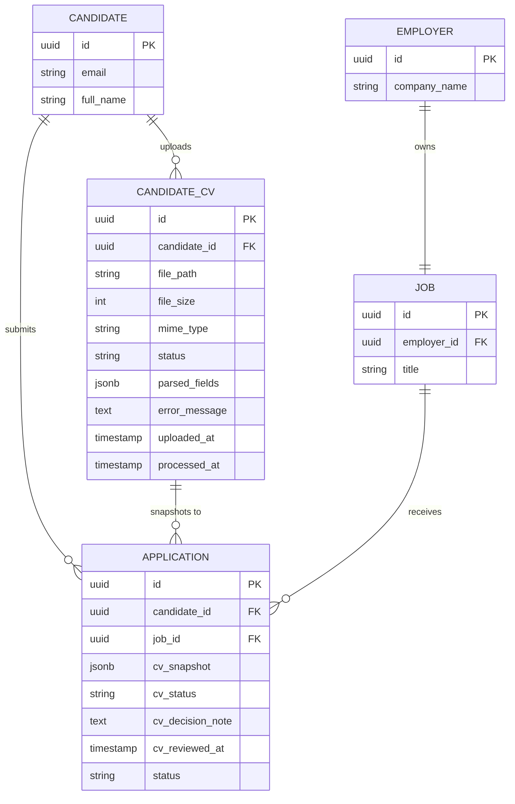
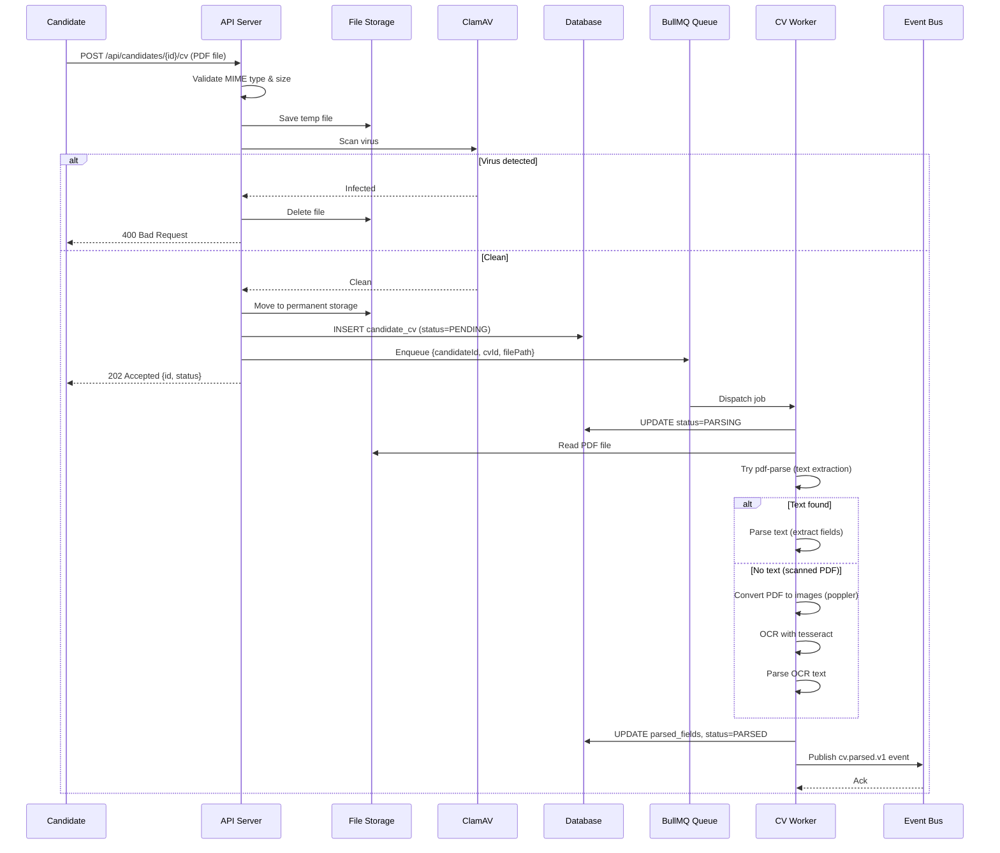
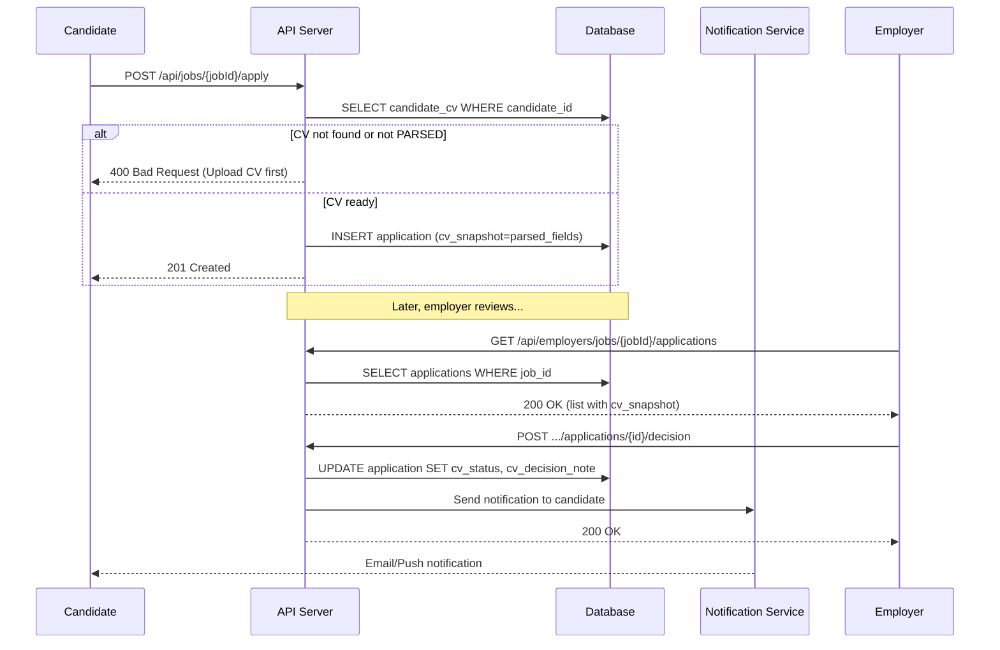

# Technical Design Document: CV Upload & OCR Pipeline

## 1. Overview

**Goal**: Cho phép ứng viên tải CV (PDF) lên, hệ thống tự động trích xuất thông tin (OCR + parsing) và lưu dữ liệu có cấu trúc để nhà tuyển dụng tra cứu.

**Scope**: 
- API upload CV cho candidates với validation và virus scanning
- Background queue và worker để xử lý OCR/parsing
- Database schema để lưu trữ CV metadata và parsed fields
- API cho employers xem CV đã parse và đưa ra quyết định
- Event publishing cho downstream services

**Out-of-scope**: 
- Tự động khớp CV với job (matching algorithm)
- UI preview nâng cao cho CV
- Full-text search (có thể bổ sung sau thông qua event `cv.parsed.v1`)
- Bulk upload cho employers
- CV template detection và smart parsing

## 2. Requirements

### 2.1 Functional Requirements

| ID | Description |
| --- | --- |
| FR-1 | `POST /api/candidates/{candidateId}/cv` (multipart) nhận file PDF ≤10MB, kiểm tra MIME, scan virus, lưu file gốc. |
| FR-2 | Lưu metadata (candidateId, filePath, fileSize, status) vào DB và enqueue job `cvProcessingQueue`. |
| FR-3 | Worker đọc queue, thực hiện OCR/parse (text-first, fallback tesseract), trích xuất các trường: fullName, email, phone, skills[], yearsExperience, education[], summary. |
| FR-4 | Cập nhật bảng `candidate_cv`: `status` (`PENDING`, `PARSING`, `PARSED`, `FAILED`), trường `parsed_fields` (JSON), `error_message`. |
| FR-5 | `POST /api/jobs/{jobId}/apply` gắn snapshot `parsed_fields` vào application của employer tương ứng. |
| FR-6 | `GET /api/candidates/me/cv` để ứng viên xem trạng thái và dữ liệu parse của chính họ. |
| FR-7 | `GET /api/employers/jobs/{jobId}/applications` trả danh sách ứng viên ứng tuyển (gồm dữ liệu crawl + link tải CV). |
| FR-8 | `POST /api/employers/jobs/{jobId}/applications/{applicationId}/decision` cho phép employer đánh dấu CV Approved/Rejected, gửi thông báo đến ứng viên. |
| FR-9 | Publish event `cv.parsed.v1` khi parse thành công để downstream (search/indexing) xử lý. |

### 2.2 Non-Functional Requirements

| ID | Description |
| --- | --- |
| NFR-1 | Thời gian xử lý OCR trung bình ≤30s/job; retry tối đa 3 lần (exponential backoff). |
| NFR-2 | Bắt buộc scan virus (ClamAV) trước khi lưu file và trước khi worker đọc. |
| NFR-3 | Lưu metrics (Prometheus) cho số CV uploaded, thời gian parse, tỉ lệ failed. |
| NFR-4 | Storage quota: tối đa 5 file/ứng viên, mỗi file ≤10MB; xóa file cũ khi upload mới. |
| NFR-5 | File CV không được public URL trực tiếp; tải qua API có JWT hoặc signed URL (expiry ≤5 phút). |
| NFR-6 | GDPR/PII: cho phép xóa CV theo yêu cầu; log truy cập CV. |

## 3. Technical Design

### 3.1. Data Model Changes

**New Table: `candidate_cv`**

```sql
CREATE TABLE candidate_cv (
  id UUID PRIMARY KEY DEFAULT gen_random_uuid(),
  candidate_id UUID NOT NULL REFERENCES candidates(id) ON DELETE CASCADE,
  file_path VARCHAR(255) NOT NULL,
  file_size INTEGER NOT NULL,
  mime_type VARCHAR(64) NOT NULL,
  status VARCHAR(20) NOT NULL CHECK (status IN ('PENDING', 'PARSING', 'PARSED', 'FAILED')),
  parsed_fields JSONB,
  error_message TEXT,
  uploaded_at TIMESTAMP NOT NULL DEFAULT NOW(),
  processed_at TIMESTAMP,
  created_at TIMESTAMP NOT NULL DEFAULT NOW(),
  updated_at TIMESTAMP NOT NULL DEFAULT NOW()
);

CREATE INDEX idx_candidate_cv_candidate_id ON candidate_cv(candidate_id);
CREATE INDEX idx_candidate_cv_status ON candidate_cv(status);
```

**Extend Table: `applications`**

```sql
ALTER TABLE applications ADD COLUMN cv_snapshot JSONB;
ALTER TABLE applications ADD COLUMN cv_status VARCHAR(20) CHECK (cv_status IN ('PENDING', 'APPROVED', 'REJECTED'));
ALTER TABLE applications ADD COLUMN cv_decision_note TEXT;
ALTER TABLE applications ADD COLUMN cv_reviewed_at TIMESTAMP;
```

**Entity Relationship Diagram:**



**parsed_fields JSON Schema:**

```json
{
  "fullName": "string",
  "email": "string",
  "phone": "string",
  "skills": ["string"],
  "yearsExperience": "number",
  "education": ["string"],
  "summary": "string"
}
```

Example:
```json
{
  "fullName": "Nguyen Van A",
  "email": "vana@example.com",
  "phone": "+84 912 345 678",
  "skills": ["Node.js", "AWS", "Docker"],
  "yearsExperience": 5,
  "education": ["BSc Computer Science - HCMUT"],
  "summary": "5 years backend engineer with expertise in microservices..."
}
```

### 3.2. API Changes

#### Upload CV
- **Endpoint**: `POST /api/candidates/{candidateId}/cv`
- **Auth**: JWT candidate (self) hoặc admin acting-as
- **Request**: 
  - Content-Type: `multipart/form-data`
  - Body: `file` (PDF, max 10MB)
- **Response**:
  - `202 Accepted`:
    ```json
    {
      "id": "uuid",
      "candidateId": "uuid",
      "status": "PENDING",
      "uploadedAt": "2025-11-13T10:00:00Z"
    }
    ```
  - `400 Bad Request`: Invalid file type, corrupted file, virus detected
  - `413 Payload Too Large`: File exceeds 10MB
  - `401 Unauthorized`: Invalid or missing JWT
  - `403 Forbidden`: Candidate trying to upload for another candidate

#### Candidate View Own CV
- **Endpoint**: `GET /api/candidates/me/cv`
- **Auth**: JWT candidate
- **Response**:
  - `200 OK`:
    ```json
    {
      "id": "uuid",
      "status": "PARSED",
      "parsedFields": {
        "fullName": "Nguyen Van A",
        "email": "vana@example.com",
        "phone": "+84 912 345 678",
        "skills": ["Node.js", "AWS"],
        "yearsExperience": 5,
        "education": ["BSc Computer Science"],
        "summary": "..."
      },
      "uploadedAt": "2025-11-13T10:00:00Z",
      "processedAt": "2025-11-13T10:00:25Z",
      "downloadUrl": "https://api.example.com/api/candidates/me/cv/download?token=..."
    }
    ```
  - `404 Not Found`: No CV uploaded yet

#### Candidate Apply to Job
- **Endpoint**: `POST /api/jobs/{jobId}/apply`
- **Auth**: JWT candidate
- **Request**:
  ```json
  {
    "note": "I am very interested in this position",
    "preferredStartDate": "2025-12-01"
  }
  ```
- **Response**:
  - `201 Created`:
    ```json
    {
      "id": "uuid",
      "jobId": "uuid",
      "candidateId": "uuid",
      "status": "SUBMITTED",
      "cvSnapshot": { /* parsed_fields */ },
      "appliedAt": "2025-11-13T10:00:00Z"
    }
    ```
  - `400 Bad Request`: Already applied, no CV uploaded
  - `404 Not Found`: Job not found

#### Employer List Applications
- **Endpoint**: `GET /api/employers/jobs/{jobId}/applications`
- **Auth**: JWT employer (must own the job)
- **Query Params**: `?page=1&limit=20&status=SUBMITTED`
- **Response**:
  - `200 OK`:
    ```json
    {
      "data": [
        {
          "applicationId": "uuid",
          "candidateId": "uuid",
          "cvSnapshot": {
            "fullName": "Nguyen Van A",
            "email": "vana@example.com",
            "skills": ["Node.js"]
          },
          "cvStatus": "PENDING",
          "appliedAt": "2025-11-13T10:00:00Z",
          "downloadUrl": "https://api.example.com/api/employers/applications/{id}/cv?token=..."
        }
      ],
      "pagination": {
        "page": 1,
        "limit": 20,
        "total": 45
      }
    }
    ```

#### Employer Decision on CV
- **Endpoint**: `POST /api/employers/jobs/{jobId}/applications/{applicationId}/decision`
- **Auth**: JWT employer (must own the job)
- **Request**:
  ```json
  {
    "cvStatus": "APPROVED",
    "note": "Great experience, moving to interview"
  }
  ```
- **Response**:
  - `200 OK`:
    ```json
    {
      "applicationId": "uuid",
      "cvStatus": "APPROVED",
      "cvDecisionNote": "Great experience, moving to interview",
      "cvReviewedAt": "2025-11-13T11:00:00Z"
    }
    ```
  - `404 Not Found`: Application not found
  - `403 Forbidden`: Employer doesn't own this job

### 3.3. UI Changes

**N/A** - This feature is backend-only. Mobile app and web frontend will consume the APIs independently.

### 3.4. Logic Flow

**CV Upload and Processing Flow:**



**Application Flow:**



### 3.5. Dependencies

**New NPM Packages:**

- `pdf-parse` (^1.1.1): Extract text from PDF files
- `tesseract.js` (^5.0.0): OCR engine for scanned PDFs
- `multer` (^1.4.5-lts.1): Multipart file upload handling
- `clamscan` (^2.1.2): ClamAV Node.js client for virus scanning
- `bullmq` (already in project): Job queue management

**System Dependencies (Dockerfile):**

- `tesseract-ocr`: OCR engine binary
- `tesseract-ocr-eng`: English language data
- `tesseract-ocr-vie`: Vietnamese language data (optional)
- `poppler-utils`: PDF to image conversion (`pdftoppm`)
- `ghostscript`: PDF processing utilities
- `clamav-daemon`: Virus scanning service (or use external service)

**External Services:**

- Redis: BullMQ queue backend
- ClamAV: Virus scanning (can be containerized or external)
- (Optional) AWS Textract / Google Vision API: Alternative OCR providers

### 3.6. Security Considerations

1. **File Upload Security**
   - Validate MIME type strictly (`application/pdf` only)
   - Enforce file size limit (10MB) at middleware level
   - Mandatory virus scanning before persisting files
   - Generate random UUID filenames to prevent path traversal
   - Store files outside web root directory

2. **Access Control**
   - Candidates can only upload/view their own CVs
   - Employers can only view CVs of candidates who applied to their jobs
   - Use JWT authentication for all endpoints
   - Implement rate limiting on upload endpoint (max 5 uploads/hour per candidate)

3. **Data Protection**
   - Use signed URLs with short expiry (5 minutes) for CV downloads
   - Log all CV access events for audit trail
   - Support GDPR deletion requests (cascade delete CV files and records)
   - Consider encrypting `parsed_fields` at rest if PII regulations require

4. **Injection Prevention**
   - Validate and sanitize all extracted text before storing
   - Use parameterized queries for all database operations
   - Escape special characters in parsed fields

### 3.7. Performance and Reliability Considerations

1. **Processing Performance**
   - Target: 95th percentile processing time ≤30 seconds
   - Use text extraction first (fast path), fallback to OCR only when needed
   - Implement worker concurrency (start with 2-4 workers, scale based on queue depth)
   - Cache parsed results to avoid reprocessing

2. **Queue Reliability**
   - Exponential backoff retry: 3 attempts with delays (10s, 30s, 90s)
   - Dead Letter Queue (DLQ) for failed jobs after max retries
   - Job timeout: 2 minutes per job
   - Implement idempotency: check if CV already processed before starting

3. **Storage Management**
   - Enforce quota: max 5 CVs per candidate
   - Automatic cleanup: delete oldest CV when uploading 6th
   - Daily cron job to remove orphaned files (files without DB records)
   - Consider migration to S3 for scalability (abstract via `CVStorageService`)

4. **Scalability**
   - Horizontal scaling: BullMQ supports multiple worker instances
   - Stateless workers: no local state, all data in DB/Redis
   - Connection pooling for database and Redis
   - Consider CDN for CV downloads if traffic grows

### 3.8. Observability and Operations

**Logging:**
- Structured logs (JSON) with fields:
  - `requestId`: Trace requests across services
  - `candidateId`: Track user actions
  - `cvId`: Track CV lifecycle
  - `action`: `cv_upload`, `cv_parse_start`, `cv_parse_success`, `cv_parse_failed`, `cv_download`
  - `duration`: Processing time in milliseconds
  - `error`: Error details for failures

**Metrics (Prometheus):**
- `cv_upload_total` (counter): Total CV uploads, labels: `status` (success/failed)
- `cv_upload_size_bytes` (histogram): File size distribution
- `cv_parse_duration_seconds` (histogram): Parse time distribution
- `cv_parse_total` (counter): Total parse attempts, labels: `status` (parsed/failed), `method` (text/ocr)
- `cv_queue_depth` (gauge): Current queue size
- `cv_dlq_total` (counter): Jobs moved to DLQ

**Alerts:**
- Parse failure rate >10% over 15 minutes
- Queue depth >100 for >10 minutes
- Average parse time >45 seconds
- DLQ accumulation >5 jobs

**Deployment:**
- Update `Dockerfile` to include system dependencies
- Add worker start script: `npm run cv-worker`
- Environment variables documented in `.env.example`
- Health check endpoint: `GET /health/cv-worker` (returns queue stats)

## 4. Testing Plan

### Unit Tests (Jest)

**Parser Module:**
- Test email extraction from various formats
- Test phone number extraction (Vietnamese formats: +84, 0xxx)
- Test skills matching against dictionary
- Test years of experience regex extraction
- Test education parsing with various degree formats
- Mock tesseract and pdf-parse to avoid external dependencies

**CVStorageService:**
- Test file save with quota enforcement
- Test old file cleanup
- Test signed URL generation
- Test file deletion

**Validation Middleware:**
- Test MIME type validation
- Test file size validation
- Test multipart parsing

### Integration Tests (Supertest)

**Upload Flow:**
- Upload valid PDF → verify file saved, DB record created, job enqueued
- Upload invalid MIME type → verify 400 error
- Upload oversized file → verify 413 error
- Upload with virus (mock ClamAV) → verify file deleted, 400 error
- Upload 6th CV → verify oldest deleted

**Worker Processing:**
- Process text-based PDF → verify parsed_fields populated
- Process scanned PDF (mock OCR) → verify OCR path triggered
- Process corrupted PDF → verify FAILED status and error_message
- Verify retry logic with transient failures
- Verify DLQ after max retries

**Application Flow:**
- Apply to job with parsed CV → verify cv_snapshot populated
- Apply without CV → verify 400 error
- Employer list applications → verify cv_snapshot returned
- Employer decision → verify status updated, notification sent

**Access Control:**
- Candidate upload for another candidate → verify 403
- Employer view application for another employer's job → verify 403
- Download CV without auth → verify 401

### Contract Tests

**API Schema Validation:**
- Validate response schemas match OpenAPI spec
- Share JSON schemas with mobile team
- Test backward compatibility when adding new fields

### End-to-End Tests

**Happy Path:**
1. Candidate uploads CV
2. Worker processes successfully
3. Candidate applies to job
4. Employer views application with CV data
5. Employer approves CV
6. Candidate receives notification

**Error Scenarios:**
- Network failure during upload
- Worker crash mid-processing
- Database connection loss
- Redis unavailable

### Performance Tests

- Benchmark parse time with 50 diverse CV samples (text vs scanned)
- Load test: 100 concurrent uploads
- Verify worker can handle queue backlog
- Measure p95 latency under load

## 5. Open Questions

1. **OCR Provider**: Tesseract đủ chính xác cho CV tiếng Việt không? Có cần AWS Textract hoặc Google Vision API? Chi phí và latency trade-off?

2. **Template Detection**: CV có nhiều format khác nhau (Canva, Word, LaTeX). Có cần logic phát hiện template để parse tốt hơn?

3. **PII Compliance**: Có yêu cầu mã hóa `parsed_fields` at rest không? Retention policy cho CV là bao lâu?

4. **Search Integration**: Sau khi parse, có cần index vào Elasticsearch để employer search toàn bộ CV pool không? Hay chỉ search trong applications?

5. **Bulk Upload**: Có cho phép employer upload CV thay ứng viên không? Use case nào?

6. **ClamAV Deployment**: Dùng ClamAV container local hay external service (CloudAV)? Ai quản lý signature updates?

7. **Storage Migration**: Khi nào migrate từ local filesystem sang S3? Có cần CDN cho downloads không?

8. **Notification Method**: Employer decision notification gửi qua email, push notification, hay in-app notification? Cần integrate service nào?

## 6. Alternatives Considered

### Alternative 1: Synchronous Processing
**Rejected**: Xử lý OCR đồng bộ trong request handler sẽ block response 20-30 giây, gây timeout và UX kém. Queue + worker cho phép trả response ngay và xử lý background.

### Alternative 2: AWS Textract Instead of Tesseract
**Deferred**: Textract có độ chính xác cao hơn nhưng chi phí $1.50/1000 pages. Bắt đầu với Tesseract (free), monitor accuracy, migrate nếu cần.

### Alternative 3: Store Parsed Fields in Separate Table
**Rejected**: Lưu `parsed_fields` trong bảng riêng thay vì JSONB column. Tăng complexity (joins) mà không có lợi ích rõ ràng. JSONB đủ flexible và performant với indexing.

### Alternative 4: Real-time Parsing with WebSocket
**Rejected**: Stream parsing progress qua WebSocket phức tạp và không cần thiết. Candidate có thể poll `GET /api/candidates/me/cv` hoặc nhận notification khi done.

### Alternative 5: Client-side OCR (Mobile App)
**Rejected**: Chạy OCR trên mobile device tốn battery và không consistent. Server-side processing đảm bảo quality và centralized data.

---

**Next Steps**: 
1. Xác nhận open questions với product team
2. Chốt OCR provider (Tesseract vs Textract)
3. Chốt ClamAV deployment strategy
4. Review và approve TDD
5. Generate task breakdown
6. Begin implementation: schema → storage → upload API → worker → employer APIs
