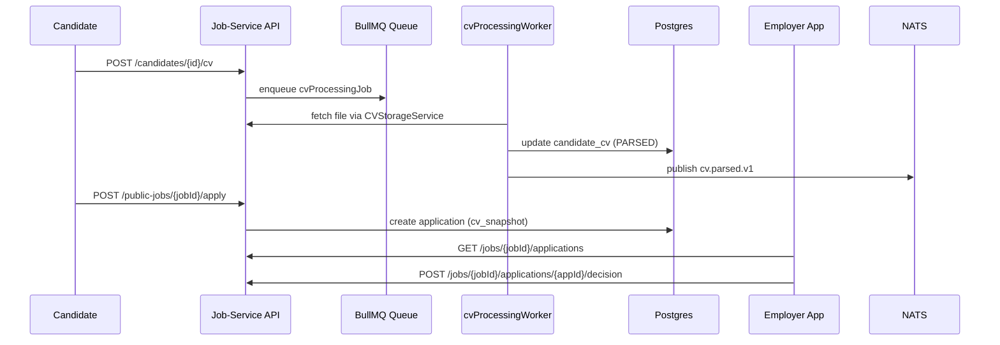

# CV Pipeline Runbook

This runbook describes how the CV upload → OCR → parsing → employer review pipeline works, how it is deployed, and how to operate / troubleshoot it in production.

## 1. Architecture & Flow

```
Candidate → POST /api/candidates/{id}/cv
            │
            │ (multer, validation, ClamAV)
            ▼
      CVStorageService (local disk / shared volume)
            │
            │ enqueue
            ▼
      BullMQ cvProcessingQueue ──► Worker pods
            │                        (OCRService + CVParserService)
            │                        ├─ pdf-parse (text layer)
            │                        └─ tesseract.js + poppler (scanned)
            ▼
      candidate_cv table (status PARSED, parsed_fields JSON)
            │
            ├─ event: cv.parsed.v1 (NATS)
            └─ Candidate applies → application.cv_snapshot
                                     │
                                     └─ Employer GET /api/jobs/{jobId}/applications
                                          → POST decision → cv.decision.v1
```

Key components:
- **API layer**: Express routes (`candidates.routes.ts`, `publicJobs.routes.ts`, `employerJobs.routes.ts`).
- **Storage**: `CVStorageService` saves PDFs under `CV_STORAGE_DIR`, enforces quota (5 files) and signed download tokens.
- **Virus scanning**: `VirusScanService` (clamscan) blocks infected uploads.
- **Queue**: `cvProcessingQueue` (BullMQ) with default 3 attempts + exponential backoff; DLQ is `cvProcessing.dlq`.
- **Worker**: `cvProcessingWorker.ts` transforms PDF → text → parsed fields, publishes events, records metrics.
- **Metrics**: Prometheus counters/gauges defined in `cvMetrics.ts`.

## 2. Worker Deployment & Scaling

Recommended baseline:
- 2 worker replicas, each with concurrency=2 (`lockDuration: 120s`).
- CPU: 1 vCPU per worker (OCR is CPU-heavy). Memory: 1–2 GB.
- Mounted volume or object store access to `CV_STORAGE_DIR`.
- Environment variables (subset):
  - `CV_STORAGE_DIR`, `CV_MAX_FILE_SIZE_BYTES`, `CV_ALLOWED_MIME_TYPES`
  - `CV_MAX_FILES_PER_CANDIDATE`, `CV_SIGNED_URL_TTL_SECONDS`
  - `CLAMAV_HOST`, `CLAMAV_PORT`
  - `OCR_PROVIDER`, `TESSERACT_LANG`, `CV_PROCESSING_QUEUE`, `CV_DLQ`
- Scaling guidance:
  - Increase `WORKER_REPLICAS` when `cv_processing_queue_depth` > 50 for >10 min.
  - Tune `config.queues.cvProcessing.concurrency` (default 2). Don’t exceed CPU cores.
  - Ensure Redis connections per worker < Redis max clients.

## 3. Troubleshooting Common Issues

| Symptom | Checks | Remediation |
| --- | --- | --- |
| Upload fails with 400/413 | Inspect API logs for `ERR_INVALID_FILE`, `ERR_FILE_TOO_LARGE`. | Guide candidate to PDF only, <=10 MB. |
| Upload returns 202 but never PARSED | `cv_processing_worker` logs, `candidate_cv` status stuck PENDING. | Verify worker pods running, queue healthy; check DLQ. |
| Worker errors `CV file not found` | Storage path missing. | Confirm shared volume, ensure worker sees same `CV_STORAGE_DIR`. |
| OCR failure spikes | Logs `cv_processing_ocr_failed`. | Validate poppler/tesseract binaries; check if PDFs are encrypted; widen retry attempts temporarily. |
| Employers cannot download CV | `cvDownloadAuthorization` returning 403. | Ensure employer owns job; verify signed tokens not expired; check JWT audience/issuer. |

### Checklist
- `kubectl logs deploy/cv-worker`
- `bull-board` or `redis-cli` to inspect queues.
- `SELECT id,status,error_message FROM candidate_cv WHERE status='FAILED' ORDER BY uploaded_at DESC LIMIT 20;`
- Confirm ClamAV/Tesseract services healthy.

## 4. DLQ Handling

DLQ queue name defined in `config.queues.cvProcessing.dlqName` (default `cvProcessing.dlq`). Worker pushes any failed job after max retries with original payload.

Steps:
1. Use BullMQ dashboard or `redis-cli` to read DLQ entries.
2. Cross-check `candidate_cv.errorMessage` for context.
3. Fix underlying issue (e.g., corrupted PDF, missing fonts, storage).
4. Requeue manually:
   ```ts
   const deadJob = await cvProcessingDlq.getJob(jobId);
   await cvProcessingQueue.add('retry', deadJob.data);
   await cvProcessingDlq.remove(jobId);
   ```
5. For permanently bad files, mark `candidate_cv.status = 'FAILED'` and notify candidate.

Document incidents in `docs/runbooks/cv-pipeline-alerts.md`.

## 5. Metrics & Alerts

Prometheus metrics from `cvMetrics.ts`:
- `cv_upload_total{status}` – count success/failure.
- `cv_upload_size_bytes` – histogram of upload sizes.
- `cv_processing_queue_depth{queue}` – gauge for waiting/delayed jobs.
- `cv_parse_duration_seconds` – histogram of parse time. Track p50/p95.
- `cv_parse_total{status,method}` – success/error per method (text vs ocr).
- `cv_processing_dlq_total{reason}` – counter for DLQ adds.

Recommended alerts (detailed in `cv-pipeline-alerts.md`):
- Parse failure rate >10% over 15m.
- Queue depth >100 for 10m.
- Median parse time >45s.
- DLQ accumulation >5 jobs.

Dashboard ideas:
- Upload throughput & success rate.
- Worker concurrency usage (CPU).
- OCR vs text extraction distribution.

## 6. Flow Diagrams

See architecture block above. For docs or onboarding decks, embed draw.io / mermaid:



Keep this runbook updated whenever new steps are added (e.g., rate limiting changes, new alert thresholds).
